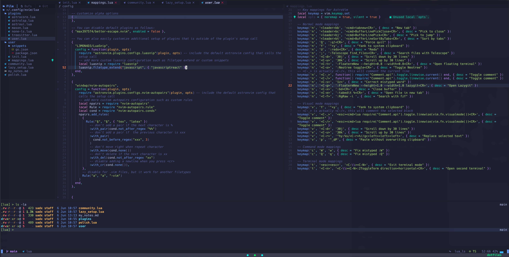
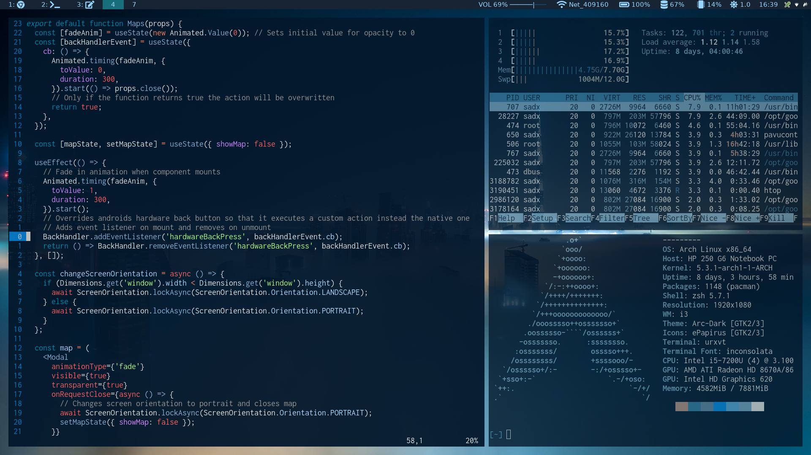

# Personal dotfiles for MacOS and Linux + NeoVim configs

Personal dotfiles for current (macOS) and older (Arch Linux) setups with extensive customizations for zsh, tmux, i3-gaps, polybar, and rofi, as well as a robust NeoVim configuration.

**MacOS (current):**

**Linux (outdated):**

